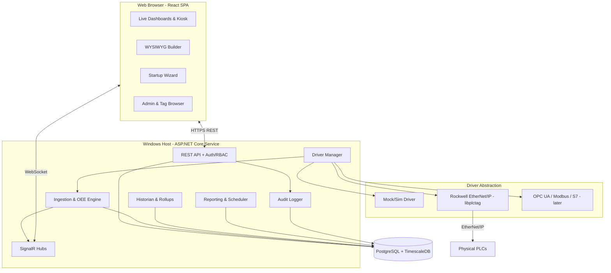

# 03 - Architecture

## Diagram

## Modular components

- Backend API
- PLC driver service
- Real-time update service
- Database layer
- Web UI frontend
- Authentication + RBAC
- Dashboard rendering engine
- Reporting engine
- Historian engine
- Audit logging service

## Backend solution layout (planned)

- `ConnectOEE.Api` - controllers, SignalR hubs, auth, DI composition root, Windows Service host.
- `ConnectOEE.Core` - domain entities, OEE math, value objects, interfaces (`IPlcDriver`, `IHistorian`).
- `ConnectOEE.Infrastructure` - EF Core (Npgsql), repositories, migrations, TimescaleDB setup.
- `ConnectOEE.Drivers` - driver abstraction + `MockDriver` + `RockwellDriver` (libplctag) + UDT parser.
- `ConnectOEE.Historian` - ingestion buffer, rollup jobs, retention/archiving.
- `ConnectOEE.Reporting` - report generation (PDF via QuestPDF, CSV) + scheduler.
- `ConnectOEE.Tests` - unit/integration tests.

## Frontend layout (planned)

`frontend/` Vite app:

- `features/` - dashboards, plant-explorer (hierarchy navigation), builder, wizard, tag-browser, reports, admin, auth.
- `components/` - widget library, gauges, charts.
- `lib/` - api client, signalr client, rbac helpers.
- `theme/` - design tokens, dark/light.

## Key principles

- Modular driver + historian + reporting interfaces for extensibility.
- Single-port local serving (API + static SPA) for simple on-prem deployment.
- Real-time pipeline: Driver -> Ingestion/OEE engine -> Historian (persist) + SignalR (push) -> SPA.
