# Plant Explorer Reimagine — 2026-07

Full visual + navigation redesign of Plant Explorer, plus an in-place refresh of the shared widget primitives it depends on so Analytics and Operator Station automatically inherit the same premium look. Frontend-only; no backend/API changes.

## Why

The previous Plant Explorer was a fixed two-pane layout: an always-expanded inline tree (`PlantBranch`/`DeptBranch`/`LineBranch`/`NodeRow`) in a fixed-height scroll area, next to a detail panel styled with plain `Card`/`Paper`. Problems:

- Local, ad-hoc status primitives (`ExplorerStatusDot`, `ExplorerOeeBadge`, `ExplorerOeeMiniBar`) that didn't match the polished widget design system (`WidgetSurface`, `StatusPill`, `PresentationKpi`) already used on dashboards.
- Inconsistent OEE color semantics — the tree used a 4-tier color function, but `MachineGridCard`'s ring was always teal regardless of OEE.
- Hardcoded hex colors, magic-number spacing, no loading/error state for the hierarchy fetch, a fixed-height tree that didn't adapt to viewport, and no URL sync on selection.

## What changed

### Shared primitives (propagates to Analytics + Operator Station)

- Unified OEE color/status semantics into tiered helpers in `frontend/src/components/widgets/common.tsx`: `oeeExplorerHexColor`, `oeeExplorerBadgeColor`, `statusSurfaceTone`, `oeeSurfaceTone`, `explorerRunStateColor`. Used everywhere — breadcrumb pills, drill-grid cards, `MachineGridCard` rings, `ModernKpiHero`.
- `ModernKpiHero.tsx` refreshed with `WidgetSurface` tone/elevation (fixes a bug where the OEE ring stayed teal regardless of connection state) — automatically updates Explorer's KPI hero, Analytics' overview tab, and Operator Station's `OperatorMachineHero`.
- `MachineGridCard.tsx` refreshed: tiered ring color instead of always-teal, hover-lift motion, `interactive` prop — automatically updates Operator Station's `StationGrid` and the new Explorer drill grid.
- `hierarchy.ts`: added `flattenHierarchyTree` + surfaced fetch error handling (previously swallowed failures silently).

### Navigation model

Replaced the static, always-expanded tree with a breadcrumb-driven card canvas:

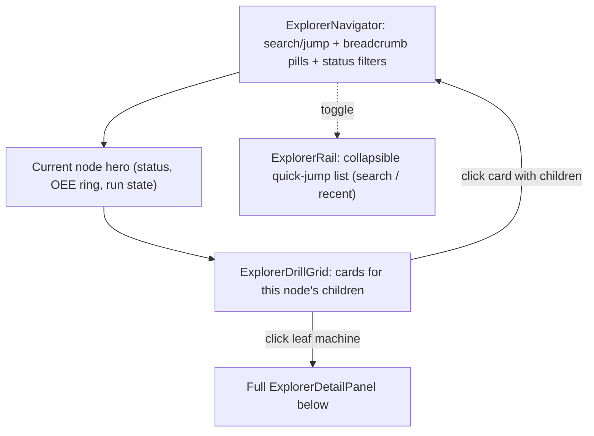
```mermaid
flowchart TD
  Nav[ExplorerNavigator: search/jump + breadcrumb pills + status filters] --> Hero["Current node hero (status, OEE ring, run state)"]
  Hero --> Grid[ExplorerDrillGrid: cards for this node's children]
  Grid -->|click card with children| Nav
  Grid -->|click leaf machine| Detail[Full ExplorerDetailPanel below]
  Nav -.->|toggle| Rail["ExplorerRail: collapsible quick-jump list (search / recent)"]
```

- **`useExplorerNav`** (`frontend/src/lib/useExplorerNav.ts`): selection state, breadcrumb derivation, bidirectional `?scope=Level:id` URL sync (deep-linkable, back-button aware), recent-selection history, status filter, and a flattened search index — plus loading/error state for the hierarchy fetch.
- **`ExplorerNavigator`**: sticky search/jump combobox (custom `renderOption` with status dot + level + OEE% badge), breadcrumb pills (status dot + OEE% per pill), status filter chips, rail toggle. Collapses to a back button on mobile (`useMediaQuery`).
- **`ExplorerRail`**: collapsible quick-jump list (recent + searchable full index); off-canvas `Drawer` on mobile, inline column on desktop.
- **`HierarchyNodeCard`**: the primary drill unit for Plant/Department/Line children — `WidgetSurface`-toned card, status beacon, OEE `GaugeRing`, run-state `StatusPill`, child count / active product, hover-lift + keyboard focus.
- **`ExplorerDrillGrid`**: responsive grid of `HierarchyNodeCard` (or `MachineGridCard` for machine-level children), with empty and no-filter-match states.
- **`ExplorerNodeHero`**: compact "you are here" summary between the navigator and the drill grid.
- `PlantExplorerPage.tsx` rewritten to compose Navigator + Rail + NodeHero + DrillGrid + `ExplorerDetailPanel`, with loading skeletons, a retryable error alert, and an empty state for unconfigured plants. `ExplorerMachineStrip` retired (absorbed by the drill grid); `ExplorerChildCompare` folded into a "Compare" section in the detail panel.

### Detail panel visual overhaul

- `ExplorerDetailPanel` / `ExplorerDetailSections` / `ExplorerPartsSection` restyled with `WidgetSurface`/`WidgetFrame`/`PresentationKpi` instead of plain `Card`/`Paper`/`MetricHero`.
- `explorerStatus.tsx` pruned to just `ConnectionPill` — `ExplorerStatusDot`, `ExplorerOeeBadge`, `ExplorerOeeMiniBar` replaced by design-system equivalents.
- Hardcoded hex in `ExplorerPartsSection.tsx` replaced with the shared `statusColors.fault` token.

### Responsiveness & motion

- `frontend/src/components/widgets/design/premiumMotion.css` (imported globally): `.hoverLift` for interactive card press/hover states, `.explorerFadeIn` / `.explorerDrillTransition` for drill navigation, all respecting `prefers-reduced-motion`.
- Mobile: single-column card grid, `ExplorerRail` becomes an off-canvas drawer, breadcrumb collapses to a back button + current node name.

## Cross-feature verification (manual QA, 2026-07)

Since Phase 1 primitives are shared, Analytics and Operator Station were regression-checked alongside Explorer:

| Area | Check | Result |
|---|---|---|
| Explorer | Drill Plant → Department → Line → Machine, breadcrumb/URL sync, hero + detail panel render at every level | Pass — see screenshots below |
| Explorer | Status filter chips, search/jump combobox, quick-jump rail | Pass |
| Explorer | Mobile viewport (390×844): collapsed breadcrumb, stacked filter chips, single-column grid | Pass |
| Explorer | Dark mode: tone-aware surfaces (amber/red/green tints), ring colors, contrast | Pass |
| Analytics | `ModernKpiHero` OEE ring color now reflects actual OEE tier (previously stuck teal) | Pass |
| Operator Station | `StationGrid` / `MachineGridCard` tiered ring colors, hover states | Pass |

### Screenshots

Light mode, desktop, drilling Plant → Line → Machine:

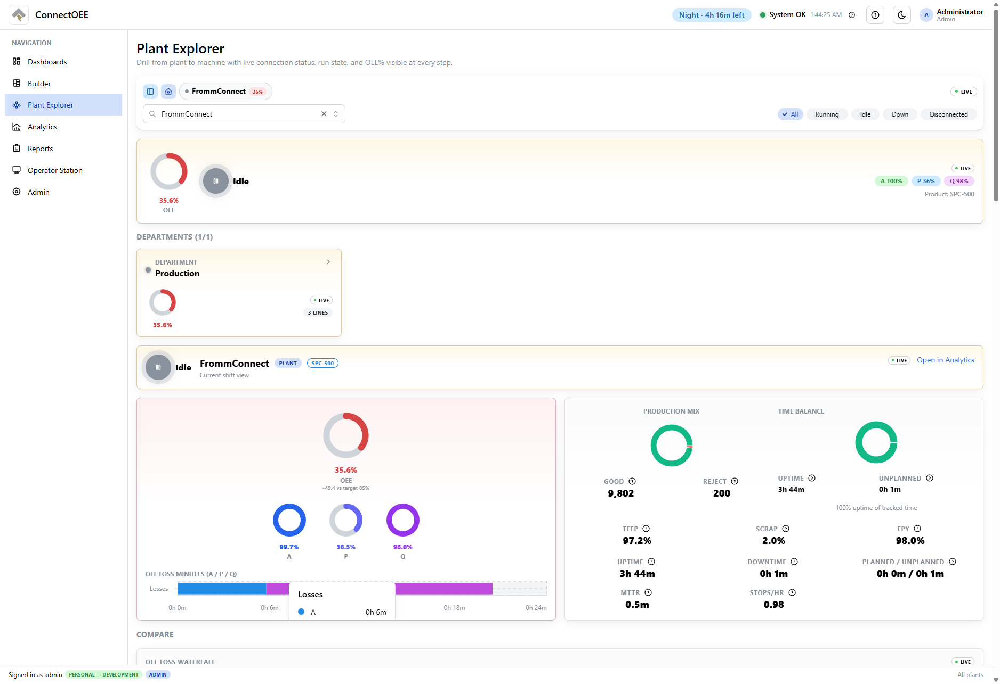
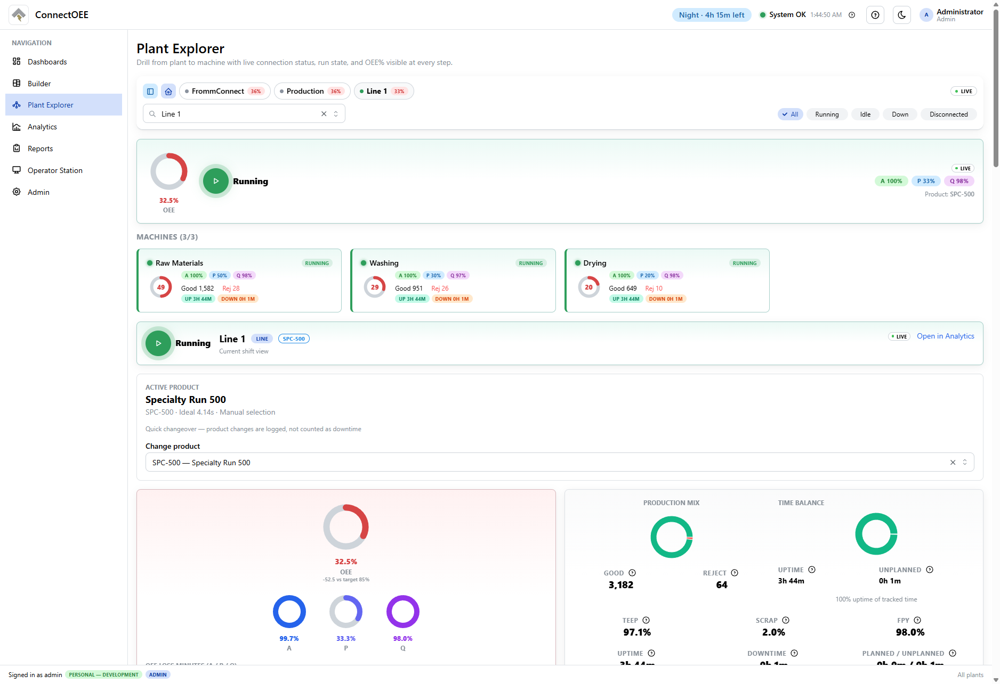
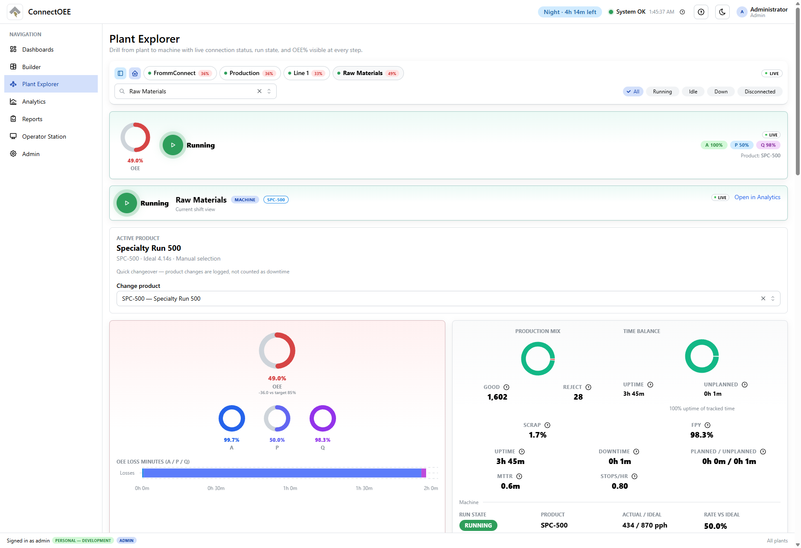

Dark mode (Line level) and mobile viewport (390×844):

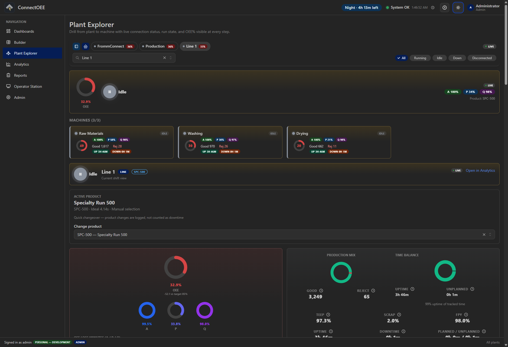

Analytics and Operator Station regression (dark mode, inherited primitives):

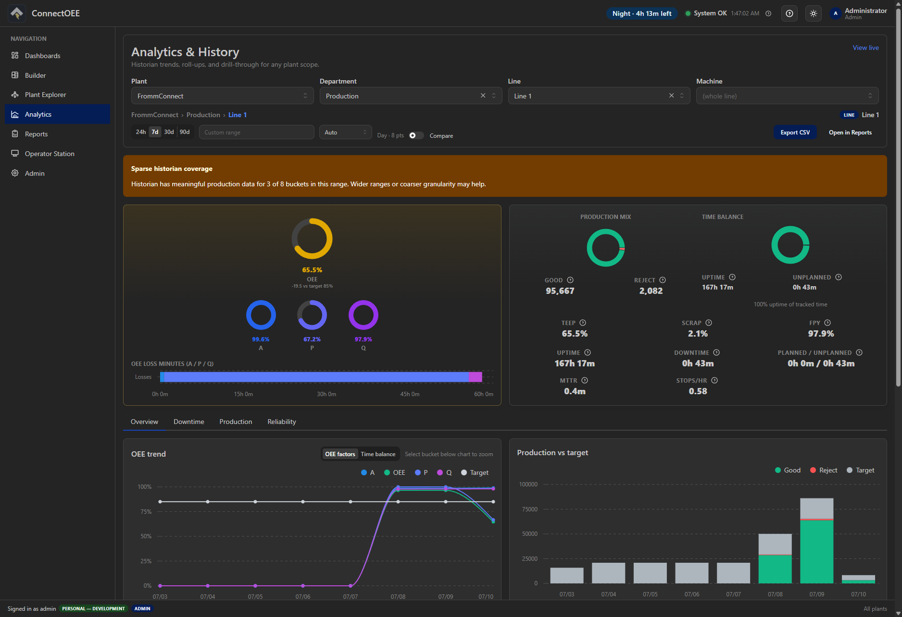
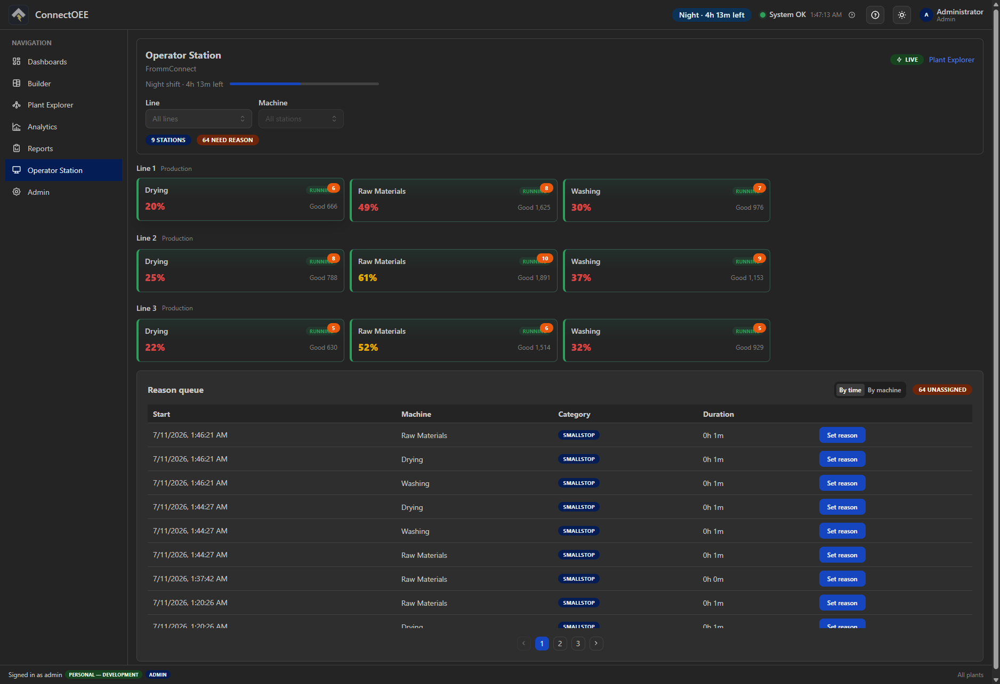

## Follow-up polish: disambiguation + recents clutter (2026-07)

Post-launch feedback: same-named machines (every line has a "Raw Materials"/"Washing"/"Drying") were indistinguishable in the jump-search dropdown, and the Rail's "Recent" section was a visually noisy flat list indistinguishable from the full hierarchy below it.

- `hierarchy.ts` / `explorerTree.ts` / `explorerTypes.ts`: every flattened search-index node now carries a `parentPath` — the ancestor chain joined as `"Plant › Dept › Line"` (excludes the node itself).
- `ExplorerNavigator`'s jump-search `renderOption` shows `parentPath` as a dimmed subtitle under each option's name, so e.g. "Drying" under Line 1 vs Line 2 vs Line 3 are all visually distinct.

  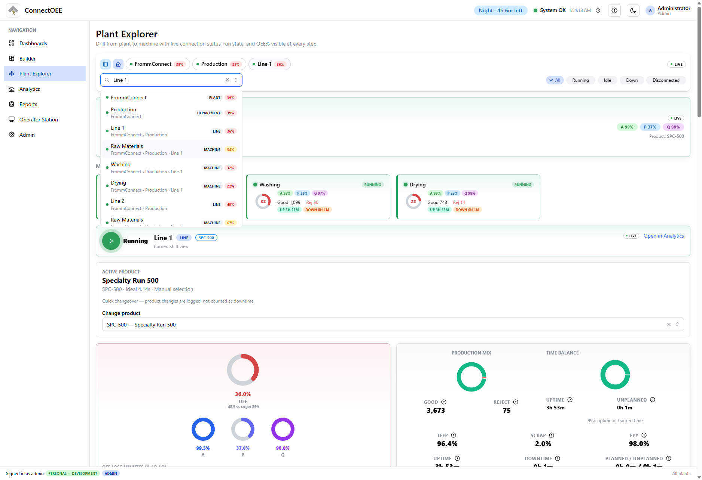

- `ExplorerRail`'s Recent section was rewritten from indented tree rows (identical styling to the full list, easy to confuse with it) into a compact, visually distinct chip group in its own shaded card: each `RecentChip` shows the node name plus its *immediate* parent as a small subtitle (e.g. "Raw Materials" / "Line 3"), wrapping horizontally instead of stacking as full-width rows. The full hierarchy list below now has an "All plants" label to reinforce the separation. Recent count capped at 5 (was 6) to keep it scannable.

  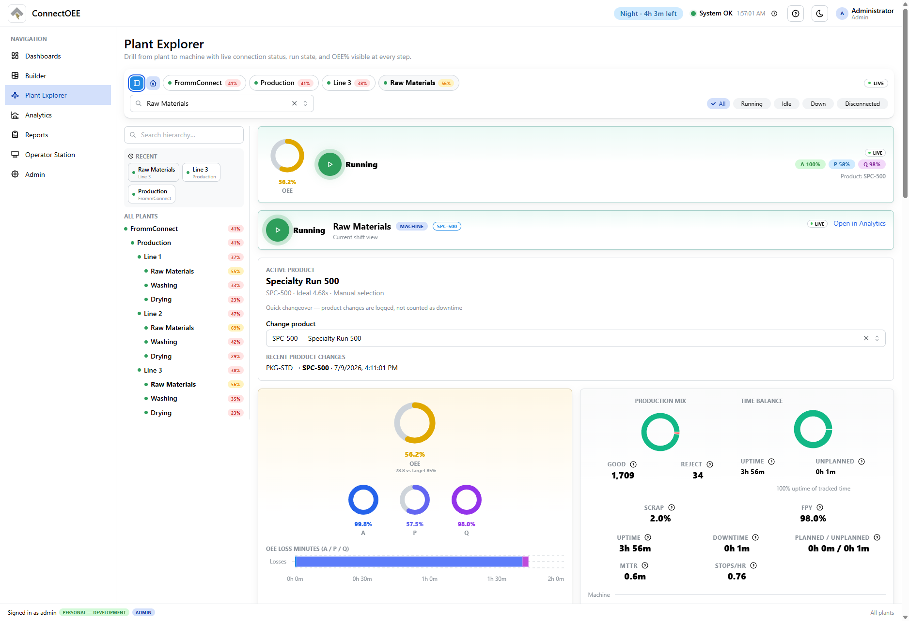
  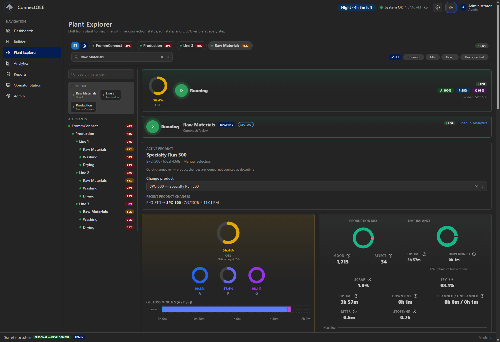

## Follow-up polish #2: hero card grouping + duplicate Machine header (2026-07)

Post-launch feedback on the OEE hero pair (OEE ring/A-P-Q/loss-bar card + Production Mix/Time Balance card) and the Machine-level header: the loss-bar chart had no legend (color-to-factor mapping was tooltip-only), the dense metric rows in the right-hand card ran together with no visual grouping, the `ExplorerNodeHero` A/P/Q badges used colors (`green`/`blue`/`grape`) that didn't match the factor identity colors used everywhere else (rings, loss bar), and selecting a Machine (leaf node, no children) stacked two near-duplicate headers back-to-back — the compact node hero and the detail panel's sticky header — since there's no drill grid between them to separate the two.

- `ModernKpiHero.tsx` (shared — Explorer, Analytics, Operator Station all inherit this): added a legend (`withLegend`) to the OEE loss-minutes bar chart, and `Divider`s separating the donut/time-balance row, the TEEP/Scrap/FPY row, and the Uptime/Downtime/MTTR/Stops-hr row into clear visual groups instead of one long stack.
- `ExplorerNodeHero.tsx`: fixed A/P/Q badge colors to `blue`/`indigo`/`grape`, matching `oeeFactorColors` (the same identity used by every ring and the loss-bar legend).
- Machine-level header merge: `PlantExplorerPage.tsx` now only renders the compact `ExplorerNodeHero` when the selected node has children (Plant/Department/Line — where the drill grid provides separation from the sticky header further down). For Machine leaves, `ExplorerDetailPanel`'s sticky header absorbed the ring + A/P/Q badges that `ExplorerNodeHero` used to show, so there's a single unified header (ring, status pill, name/level/product badges, connection pill, A/P/Q badges, "Open in Analytics") instead of two stacked ones.

  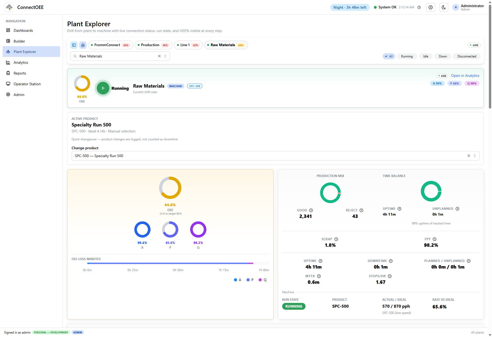
  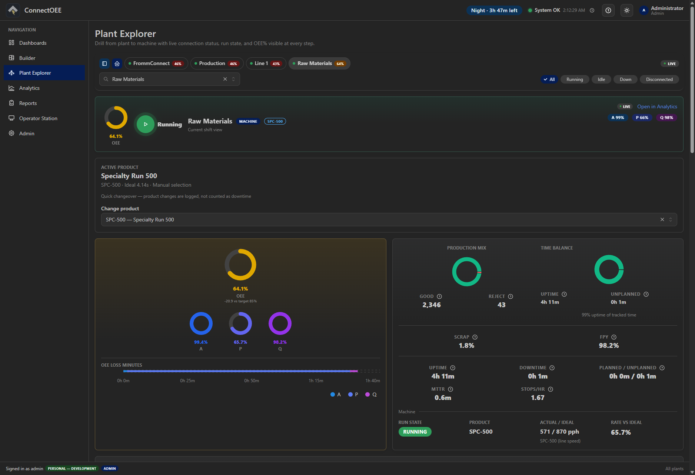
  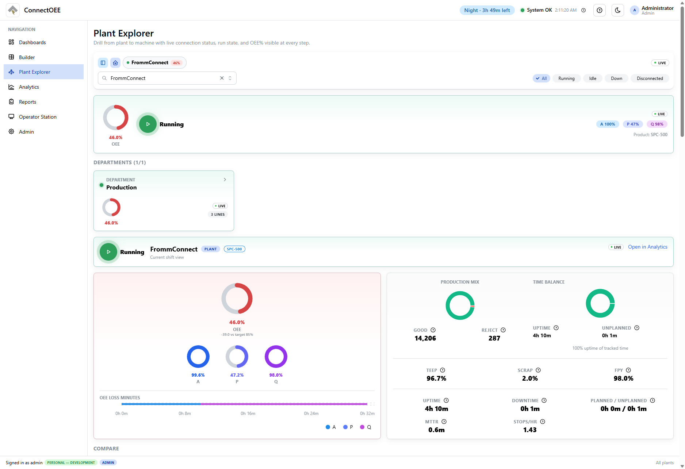

- Regression-checked on Analytics and Operator Station (both consume `ModernKpiHero` directly) — dividers/legend render correctly, no layout breakage:

  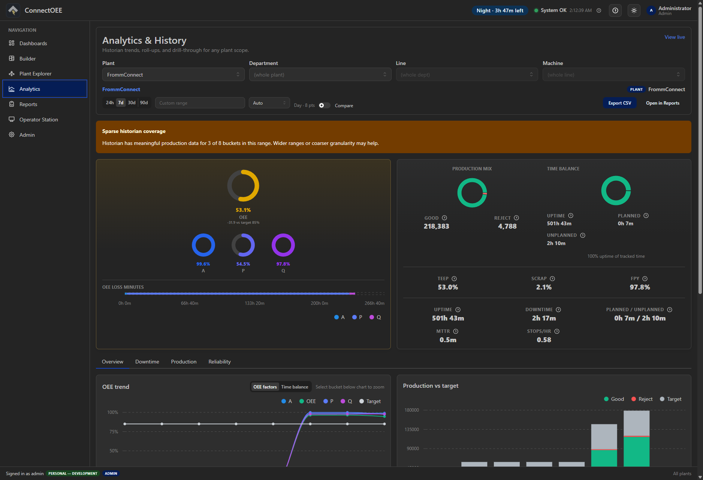
  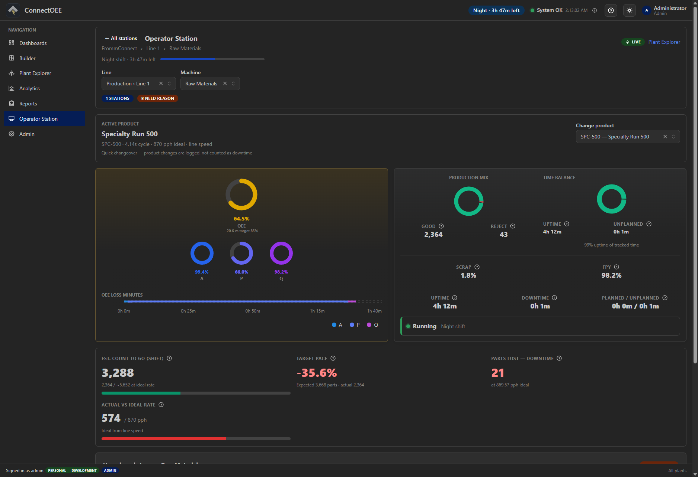

## Verification

- `npx tsc -b tsconfig.json --force` — no errors.
- `npx oxlint` — no new warnings (pre-existing `only-export-components` / `exhaustive-deps` / `no-children-prop` warnings only, consistent with existing codebase conventions).
- `npm run build` — production build succeeds.
- Manual browser QA across breakpoints/themes/hierarchy levels (table above).

## Ground-up cockpit rebuild (2026-07)

Incremental band reshuffles were replaced by a **full Explorer UI rewrite**. Data hooks (`useExplorerNav`, `explorerTree`, `explorerKpi`, `useExplorerHistorian`) stayed; shells and tiles did not.

### Page architecture

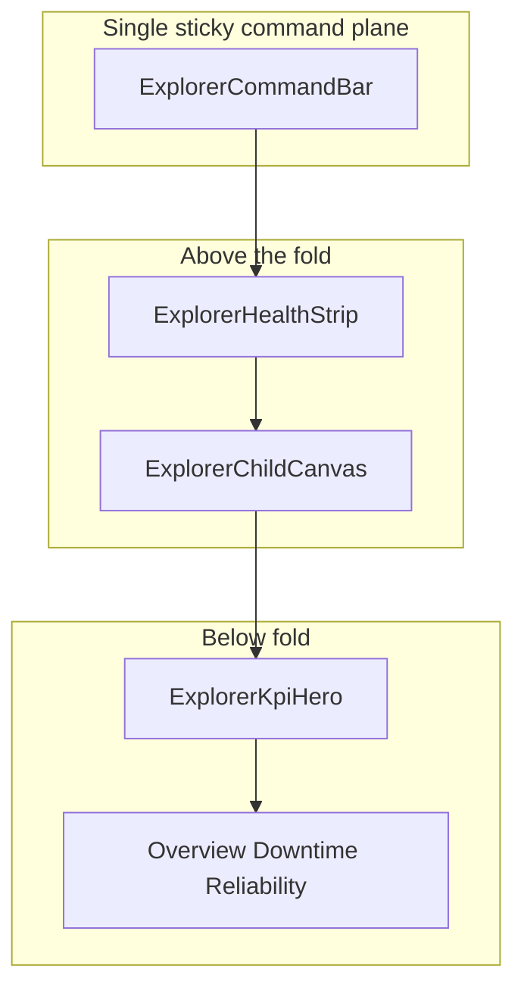
```mermaid
flowchart TB
  subgraph command [Single sticky command plane]
    Bar[ExplorerCommandBar]
  end
  subgraph primary [Above the fold]
    Health[ExplorerHealthStrip]
    Canvas[ExplorerChildCanvas]
  end
  subgraph secondary [Below fold]
    Hero[ExplorerKpiHero]
    Tabs[Overview Downtime Reliability]
  end
  Bar --> Health --> Canvas --> Hero --> Tabs
```

| Band | Component | Role |
|------|-----------|------|
| **Command plane** | `ExplorerCommandBar` | Sticky `WidgetSurface`: rail/home, breadcrumb, search, status filters, hub live, scope identity (no OEE ring), Analytics link, full `ExplorerShiftPanel` |
| **Health** | `ExplorerHealthStrip` | Fleet health + lowest-OEE plants at root; APQ + child run counts when scoped |
| **Children** | `ExplorerChildCanvas` + `ExplorerChildTile` | One tile language Plant→Machine (no `MachineGridCard` / `HierarchyNodeCard`) |
| **Insights** | `ExplorerInsights` | One `ModernKpiHero`; URL-synced `?tab=`; Overview compact compare |
| **Shift atom** | `ExplorerShiftPanel` | `full` in command bar, `compact` on plant tiles; gate `(lineId \|\| plantId)` only |

**Deleted:** `ExplorerNavigator`, `ExplorerScopeChrome`, `ExplorerNodeHero`, `ExplorerDrillGrid`, `HierarchyNodeCard`, `PlantShiftChip`, `ExplorerDetailPanel`, `ExplorerEnterpriseStrip`.

### Shift QA matrix

| Level | Shift source | In command plane? | Notes |
|-------|--------------|-------------------|--------|
| All plants | Compact chip on plant tiles + fleet strip | N/A (pick a plant) | Single-plant auto-select |
| Plant | `plantId` full panel | Yes | Not gated on live |
| Department | Parent `plantId` | Yes | Plant calendar |
| Line | `lineId` | Yes | Line calendar |
| Machine | Parent `lineId` | Yes | Same line shift |

### Explicit non-goals (unchanged)

- No backend/API changes
- No return to always-expanded tree
- No global header shift
- No full Analytics clone inside Explorer

## Out of scope

- Backend/API changes.
- Rewriting Analytics' scope pickers/time-range bar or Operator's reason-queue/modal logic beyond the shared component visual refresh.
- New OEE/reliability metrics.
