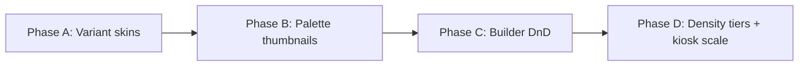

# ConnectOEE Visual Competitive Audit — July 2026

**Context:** Production-manager commissioning of FrommConnect (3 lines, Rockwell `10.0.0.49`). See [COMMISSION-REPORT-2026-07-09.md](COMMISSION-REPORT-2026-07-09.md) for functional QA.

This document captures **where ConnectOEE is strong**, **graphical gaps vs competitors**, and a **phased roadmap** for widget presentation variants and builder UX polish. **No implementation in this pass** — follow-up phases only.

---

## Benchmark set

| Vendor | Visual strength | ConnectOEE comparison |
|--------|-----------------|----------------------|
| **Tulip** | Consumer-grade apps, flexible layouts, app library thumbnails | We have depth (~98 widgets) but less "app store" polish in the palette |
| **DataMagik / Plex** | Drag-drop designer, rich chart gallery, embed in ERP screens | Similar builder intent; their palette previews and free placement feel more fluid |
| **TeepTrak / MoniTrak** | Tiered role dashboards, 55″ shop-floor readability, R/Y/G signaling | Kiosk templates exist; operator density may exceed 5–7 elements |
| **Superset / BI tools** | KPI cards, heatmaps, semantic metrics, drill-down tabs | Analytics page is strong; builder palette lacks visual "families" |

---

## Where ConnectOEE is strong

1. **OEE/reliability depth** — comprehensive math, historian, Six Big Losses, MTTR/MTBF/MTTF/MTTD ([06-oee-engine-metrics.md](06-oee-engine-metrics.md)).
2. **Brand cohesion** — ConnectOEE tokens, light/dark, status colors ([01-product-overview-ux.md](01-product-overview-ux.md)).
3. **Industrial trust UX** — connection state, stale data, shift context surfaced everywhere.
4. **Widget breadth** — ~98 widget types, 16+ system templates, design primitives under `widgets/design/`.
5. **Plant Explorer** — hierarchy tree with drill-down is a differentiator vs flat BI dashboards.
6. **Foundation for variants** — `WidgetFrame` already supports `default | hero | compact | kiosk` variants.

---

## Graphical gaps (priority order)

| Priority | Gap | PM impact | Current state |
|----------|-----|-----------|---------------|
| **1** | Presentation variants — same binding, multiple skins | Supervisors want "compact for operator, hero for lobby" without duplicating dashboards | Partial — frame variants exist; not exposed as palette picker |
| **2** | Palette "gadget library" — thumbnails, style picker, visual families | Builder feels like a config tool, not a design studio | Text buttons + category counts only |
| **3** | Information density tiers | Operator views still busy vs 3–5 metric best practice | Machine grid cards show 8+ elements |
| **4** | Builder DnD polish | Drop-at-cursor, smoother resize, optional live preview in edit mode | Drop/click-add lands at `(0,0)`; title-bar-only drag |
| **5** | Kiosk typography scale | Wallboards need larger default type/spacing at distance | Kiosk density exists but not default for all kiosk templates |
| **6** | Status signaling | R/Y/G and andon strips should dominate line/plant views | Status pills present; not prominent enough at plant roll-up |

---

## Widget variant library (recommended follow-up)

**Concept:** Keep one data binding; offer **visual variants** (like chart type, but for industrial widgets).

### Variant families

| Metric family | Variants to add |
|---------------|-----------------|
| **OEE** | ring (current), bar strip, numeric hero, traffic-light tile, mini sparkline tile |
| **A/P/Q factors** | horizontal bars, radial trio, stacked strip, gauge row |
| **Downtime** | pareto bars, donut, timeline strip, andon stack (exists), ranked list |
| **Machine status** | grid card (exists), compact strip, LED andon, heatmap row |
| **Production** | count hero, pace bar, takt comparison, shift waterfall |

### Implementation approach

| Step | Work | Files / areas |
|------|------|---------------|
| A | Add `presentation: 'ring' \| 'bar' \| 'hero' \| 'compact'` to widget options | `frontend/src/features/builder/widgetFactory.ts` |
| B | Consolidate shared renderers | `frontend/src/components/widgets/design/` |
| C | Palette thumbnails (PNG/SVG previews) | `frontend/src/components/widgets/widgetPaletteMeta.ts` |
| D | Palette UI: family row → pick variant ("gadget store") | `frontend/src/features/builder/WidgetPalette.tsx` |
| E | Docs update | [10-dashboards-widgets-templates.md](10-dashboards-widgets-templates.md), [11-wysiwyg-builder.md](11-wysiwyg-builder.md) |

**Estimate:** 2–3 phases — (A) 5 families × 3 variants, (B) palette thumbnails, (C) builder DnD fixes.

---

## Builder UX fixes (recommended follow-up)

Prioritized quick wins from PM walkthrough:

| # | Fix | Location | Effort |
|---|-----|----------|--------|
| 1 | **Drop at cursor grid cell** — compute col/row from pointer | `frontend/src/features/builder/BuilderCanvas.tsx` | Medium |
| 2 | **Full-widget drag handle option** — toolbar toggle | `BuilderToolbar.tsx`, `BuilderCanvas.tsx` | Small |
| 3 | **Palette drag preview ghost** — widget silhouette while dragging | `WidgetPalette.tsx` | Small |
| 4 | **Richer palette cards** — icon + mini preview + variant badge | `widgetPaletteMeta.ts`, `WidgetPalette.tsx` | Medium |
| 5 | **Container nesting** — child widget model for true dashboard sections | `layoutWidgets.tsx`, data model | Large (later) |

### Known limitations (documented, not fixed)

| Issue | PM impact |
|-------|-----------|
| Drop always lands at `(0,0)` | Frustrating layout |
| Title-bar-only drag handle | Feels stiff |
| `pointerEvents: none` in edit mode | Widgets feel dead while editing |
| Container/tabbed panels are placeholders | No nested layouts |
| Template apply replaces all widgets | Risky for supervisors |
| Sparse palette previews | Doesn't feel like a "library" |

---

## Phased roadmap

### Phase A — Presentation variants (2–3 sprints)

- Ship 5 metric families × 3 variants each (15 new presentation modes).
- Expose variant picker in builder Properties → Layout tab.
- Migrate 3 system templates to demonstrate variant usage (Line Overview, Operator Kiosk, Executive Summary).

### Phase B — Gadget library palette (1–2 sprints)

- Generate SVG thumbnails for top 30 widgets.
- Group palette by **visual family** (OEE, Downtime, Production, Status) not just technical category.
- Add search-by-metric ("OEE ring", "pareto downtime").

### Phase C — Builder DnD polish (1 sprint)

- Drop-at-cursor, drag ghost, optional full-widget drag mode.
- Fix click-add to append below existing widgets or drop at cursor.

### Phase D — Role density + wallboard (1 sprint)

- Operator/kiosk templates: max 5 visible metrics per tile.
- Default kiosk typography 2× on Andon and Operator Kiosk templates.
- Plant/line views: prominent R/Y/G andon strip widget in template headers.

---

## Competitive positioning summary

ConnectOEE wins on **OEE correctness, plant hierarchy, and industrial trust signals**. Competitors win on **visual merchandising** — making dashboards feel like curated apps rather than configured grids.

The highest-ROI investment is **presentation variants + palette thumbnails**: it leverages the existing 98-widget engine without rewriting data plumbing, and directly addresses the "I want more graphical options" feedback from production managers comparing to Tulip/Plex-style designers.

---

## Out of scope (this audit pass)

- Implementing builder refactors or new widget skins
- PLC tag path remediation (see commission report P0)
- Mock driver fallback (explicitly excluded per commissioning plan)
